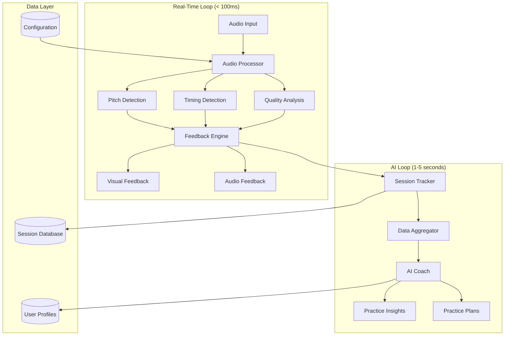
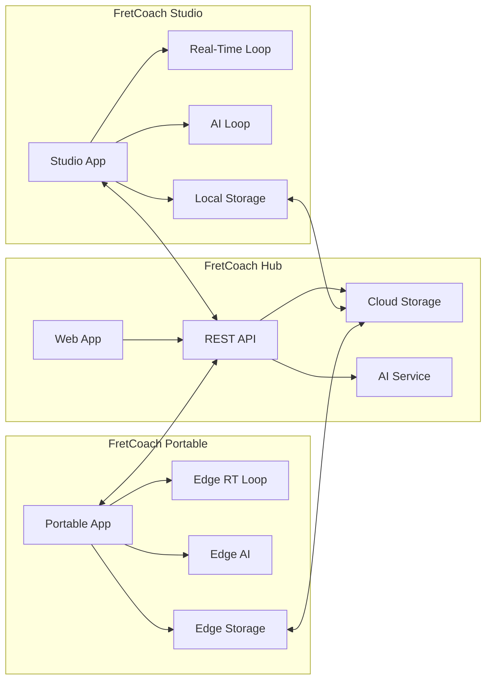

# Design Document: FretCoach System

## Overview

FretCoach implements a dual-loop architecture that separates real-time feedback from AI coaching to achieve sub-100ms response times while providing intelligent learning guidance. The system processes guitar audio through a fast deterministic loop for immediate feedback and a slower AI loop for coaching insights. This design ensures that critical real-time feedback remains responsive while leveraging AI for personalized learning recommendations.

The architecture spans three platforms: FretCoach Studio (desktop application), FretCoach Hub (web dashboard), and FretCoach Portable (Raspberry Pi device), each optimized for different use cases while maintaining consistent core functionality.

## Architecture

### System Architecture Overview



### Platform Architecture



## Components and Interfaces

### Audio Processing Pipeline

**Audio Processor**
- **Purpose**: Real-time audio signal processing and feature extraction
- **Input**: Raw audio stream from guitar (44.1kHz/48kHz, 16/24-bit)
- **Output**: Pitch data, timing data, quality metrics
- **Latency Target**: < 50ms for pitch detection, < 100ms for timing analysis
- **Implementation**: Time-domain autocorrelation for low latency, FFT for frequency analysis when needed

**Pitch Detection Engine**
- **Algorithm**: Modified autocorrelation with zero-crossing analysis for sub-20ms latency
- **Frequency Range**: 82.41Hz (low E) to 1318.51Hz (high E, 24th fret)
- **Accuracy**: ±5 cents for fundamental frequency detection
- **Polyphonic Support**: Up to 6 simultaneous notes (full guitar chord)

**Timing Analysis Engine**
- **Method**: Onset detection using spectral flux and energy-based algorithms
- **Precision**: 1ms resolution for note onset timing
- **Tempo Tracking**: Adaptive tempo estimation with beat prediction
- **Rhythm Analysis**: Pattern matching against target rhythmic sequences

### Feedback System

**Feedback Engine**
- **Visual Feedback**: Color-coded pitch accuracy, timing indicators, scale highlighting
- **Audio Feedback**: Optional metronome, pitch reference tones, error notifications
- **Haptic Feedback**: (Future enhancement) Vibration patterns for timing and pitch
- **Customization**: User-configurable sensitivity, modality preferences, intensity levels

**Real-Time Display Components**
- **Pitch Visualizer**: Real-time pitch tracking with target note overlay
- **Timing Display**: Beat grid with note placement accuracy indicators
- **Scale Overlay**: Fretboard visualization with scale notes highlighted
- **Performance Metrics**: Live accuracy percentages and error counters

### AI Coaching System

**AI Coach Engine**
- **Analysis Models**: Pattern recognition for common technical issues
- **Recommendation Engine**: Personalized practice suggestions based on performance data
- **Progress Tracking**: Skill development metrics and improvement trends
- **Adaptive Learning**: Dynamic difficulty adjustment based on user progress

**Session Analysis Pipeline**
- **Data Collection**: Performance metrics, error patterns, practice duration
- **Pattern Recognition**: Identification of recurring mistakes and technical weaknesses
- **Insight Generation**: Actionable feedback and improvement recommendations
- **Goal Setting**: Personalized practice objectives and milestone tracking

### Data Management

**Session Tracker**
- **Real-time Logging**: Performance data capture during practice sessions
- **Metrics Calculation**: Accuracy percentages, error rates, improvement indicators
- **Data Aggregation**: Session summaries and historical trend analysis
- **Export Capabilities**: Practice reports and progress visualizations

**User Profile Management**
- **Configuration Storage**: Instrument settings, tuning preferences, practice goals
- **Progress Tracking**: Skill levels, completed exercises, achievement records
- **Personalization Data**: Learning preferences, feedback settings, AI coaching history

## Data Models

### Core Data Structures

```typescript
interface AudioFrame {
  timestamp: number;
  samples: Float32Array;
  sampleRate: number;
  channels: number;
}

interface PitchData {
  frequency: number;
  confidence: number;
  timestamp: number;
  string?: number;
  fret?: number;
}

interface TimingData {
  onsetTime: number;
  duration: number;
  beatPosition: number;
  tempo: number;
  accuracy: number;
}

interface QualityMetrics {
  clarity: number;        // 0-1, string noise/fret buzz detection
  intonation: number;     // 0-1, pitch stability
  dynamics: number;       // 0-1, volume consistency
  articulation: number;   // 0-1, note separation clarity
}

interface FeedbackEvent {
  type: 'pitch' | 'timing' | 'scale' | 'quality';
  severity: 'info' | 'warning' | 'error';
  message: string;
  timestamp: number;
  correction?: string;
}

interface PracticeSession {
  id: string;
  userId: string;
  startTime: Date;
  endTime: Date;
  exerciseType: string;
  targetScale?: string;
  targetTempo?: number;
  metrics: SessionMetrics;
  events: FeedbackEvent[];
}

interface SessionMetrics {
  totalNotes: number;
  correctNotes: number;
  pitchAccuracy: number;
  timingAccuracy: number;
  overallScore: number;
  improvementAreas: string[];
}

interface UserProfile {
  id: string;
  instrumentConfig: InstrumentConfig;
  skillLevel: SkillLevel;
  practiceGoals: PracticeGoal[];
  preferences: UserPreferences;
  progressHistory: ProgressRecord[];
}

interface InstrumentConfig {
  guitarType: 'acoustic' | 'electric' | 'classical';
  tuning: string[];
  pickupType?: 'magnetic' | 'piezo' | 'microphone';
  stringGauge: string;
}

interface AIInsight {
  type: 'technique' | 'practice' | 'progress' | 'goal';
  priority: 'low' | 'medium' | 'high';
  title: string;
  description: string;
  actionItems: string[];
  relatedSessions: string[];
  generatedAt: Date;
}
```

### Database Schema

**Sessions Table**
- Primary key: session_id
- Foreign key: user_id
- Indexes: user_id, start_time, exercise_type
- Partitioning: By date for performance optimization

**Performance Events Table**
- Primary key: event_id
- Foreign key: session_id
- Indexes: session_id, timestamp, event_type
- High-frequency inserts optimized with batch processing

**User Profiles Table**
- Primary key: user_id
- JSON columns for flexible configuration storage
- Encrypted sensitive data fields

## Correctness Properties

*A property is a characteristic or behavior that should hold true across all valid executions of a system-essentially, a formal statement about what the system should do. Properties serve as the bridge between human-readable specifications and machine-verifiable correctness guarantees.*

### Property 1: Real-time Processing Latency
*For any* guitar audio input, the system should detect pitch within 50ms and provide feedback within 100ms, regardless of system load or processing complexity.
**Validates: Requirements 1.1, 1.2, 2.1, 2.2, 8.1**

### Property 2: Continuous Audio Processing
*For any* continuous audio stream, the Audio_Processor should process signals without interruption, maintaining consistent analysis throughout the session.
**Validates: Requirements 1.3**

### Property 3: Polyphonic Detection Accuracy
*For any* combination of simultaneously played guitar strings (up to 6), the Audio_Processor should identify individual pitches with correct frequency and string assignment.
**Validates: Requirements 1.4, 6.2**

### Property 4: Noise Filtering Effectiveness
*For any* guitar audio signal with background noise, the Audio_Processor should isolate and process only guitar-related frequencies while filtering out non-musical audio.
**Validates: Requirements 1.5, 6.4**

### Property 5: Comprehensive Feedback Display
*For any* detected error (pitch, timing, scale, quality), the Feedback_Engine should provide appropriate visual/audio feedback with correct deviation indicators and suggested corrections.
**Validates: Requirements 2.3, 2.4, 7.1, 7.2, 7.3, 7.4**

### Property 6: Concurrent Feedback Handling
*For any* combination of simultaneous feedback needs, the system should display all feedback types without interference or information loss.
**Validates: Requirements 2.5**

### Property 7: AI Coaching Completeness
*For any* completed practice session, the AI_Coach should generate relevant insights, identify patterns, and provide actionable recommendations based on performance data.
**Validates: Requirements 3.1, 3.2, 3.3, 3.4**

### Property 8: Personalized Practice Planning
*For any* set of user-defined practice goals, the AI_Coach should create a customized practice plan with appropriate exercises and progression milestones.
**Validates: Requirements 3.5**

### Property 9: Session Data Integrity
*For any* practice session, the Session_Tracker should completely record all performance data, calculate accurate metrics, and maintain data consistency throughout the session lifecycle.
**Validates: Requirements 4.1, 4.2, 4.3**

### Property 10: Historical Analytics Generation
*For any* set of historical practice data, the Session_Tracker should provide comprehensive analytics, trends, and comparison capabilities.
**Validates: Requirements 4.4, 4.5**

### Property 11: Cross-Platform Functionality
*For any* platform (Studio, Hub, Portable), the system should provide appropriate functionality for that platform while maintaining data synchronization across platform switches.
**Validates: Requirements 5.1, 5.2, 5.3, 5.4**

### Property 12: Offline Operation Capability
*For any* network connectivity limitation, the Portable_Device should maintain core real-time feedback functionality through local processing.
**Validates: Requirements 5.5**

### Property 13: Audio Input Validation
*For any* audio input, the Audio_Processor should validate signal quality and format, providing user feedback when quality is insufficient.
**Validates: Requirements 6.1, 6.5**

### Property 14: Timing Analysis Precision
*For any* sequence of guitar notes, the Audio_Processor should detect note onsets and durations with millisecond-level precision.
**Validates: Requirements 6.3**

### Property 15: Feedback Customization
*For any* user preference settings, the Feedback_Engine should customize feedback intensity, modality, and sensitivity according to user specifications.
**Validates: Requirements 7.5**

### Property 16: Performance Under Load
*For any* system load condition, the Real_Time_Loop should maintain priority over background processing, gracefully degrading non-critical features when necessary.
**Validates: Requirements 8.2, 8.3, 8.4, 8.5**

### Property 17: Data Security and Privacy
*For any* user data (session recordings, personal information), the system should encrypt data at rest and in transit, providing secure access controls and complete deletion capabilities.
**Validates: Requirements 9.1, 9.2, 9.3, 9.4**

### Property 18: User Consent and Control
*For any* data sharing request, the system should require explicit user consent and provide granular control over what information is shared.
**Validates: Requirements 9.5**

### Property 19: System Configuration Flexibility
*For any* guitar setup (type, tuning, pickups), the system should accept and store configuration parameters, providing appropriate calibration guidance.
**Validates: Requirements 10.1, 10.4**

### Property 20: Multi-Instrument Profile Management
*For any* number of guitars used by a single user, the system should maintain separate profiles and configurations without data interference.
**Validates: Requirements 10.5**

### Property 21: Custom Practice Goal Support
*For any* user-defined practice objectives (scales, songs, techniques), the system should accept and incorporate these goals into practice planning and feedback.
**Validates: Requirements 10.2, 10.3**

## Error Handling

### Real-Time Loop Error Handling

**Audio Processing Failures**
- **Buffer Underruns**: Implement circular buffering with overflow protection
- **Invalid Audio Format**: Graceful format conversion or user notification
- **Hardware Disconnection**: Automatic device detection and reconnection attempts
- **Processing Overload**: Dynamic quality reduction to maintain real-time performance

**Feedback System Failures**
- **Display Rendering Issues**: Fallback to simplified visual feedback modes
- **Audio Output Problems**: Silent operation with visual-only feedback
- **Timing Synchronization**: Automatic recalibration and drift correction

### AI Loop Error Handling

**Machine Learning Model Failures**
- **Model Loading Errors**: Fallback to rule-based coaching recommendations
- **Inference Timeouts**: Graceful degradation to basic pattern analysis
- **Memory Constraints**: Batch processing with reduced model complexity
- **Training Data Corruption**: Model validation and automatic retraining triggers

**Data Processing Errors**
- **Session Data Corruption**: Data validation and recovery from backups
- **Analytics Generation Failures**: Simplified metrics with error reporting
- **Database Connection Issues**: Local caching with eventual consistency

### Network and Synchronization Errors

**Connectivity Issues**
- **Network Timeouts**: Automatic retry with exponential backoff
- **Data Sync Failures**: Conflict resolution and manual merge options
- **Cloud Service Outages**: Local operation mode with sync queue

**Cross-Platform Synchronization**
- **Version Conflicts**: Timestamp-based conflict resolution
- **Partial Sync Failures**: Incremental retry with progress tracking
- **Data Integrity Issues**: Checksum validation and repair mechanisms

## Testing Strategy

### Dual Testing Approach

The FretCoach system requires both unit testing and property-based testing to ensure comprehensive coverage:

**Unit Tests** focus on:
- Specific audio processing algorithms with known input/output pairs
- Edge cases in pitch detection (very low/high frequencies, harmonics)
- Error conditions and boundary values
- Integration points between real-time and AI loops
- Platform-specific functionality and UI components

**Property-Based Tests** focus on:
- Universal properties that hold across all valid inputs
- Real-time performance guarantees under varying conditions
- Data integrity and consistency across system operations
- Security and privacy requirements validation
- Cross-platform behavior consistency

### Property-Based Testing Configuration

**Testing Framework**: Use Hypothesis (Python) or fast-check (TypeScript) for property-based testing
**Test Iterations**: Minimum 100 iterations per property test to ensure statistical confidence
**Test Tagging**: Each property test must reference its design document property using the format:
`# Feature: fretcoach-system, Property {number}: {property_text}`

**Example Property Test Structure**:
```python
@given(guitar_audio_signal())
def test_pitch_detection_latency(audio_signal):
    """Feature: fretcoach-system, Property 1: Real-time Processing Latency"""
    start_time = time.time()
    result = audio_processor.detect_pitch(audio_signal)
    end_time = time.time()
    
    assert (end_time - start_time) < 0.05  # 50ms requirement
    assert result.frequency > 0
    assert 0 <= result.confidence <= 1
```

### Testing Environments

**Real-Time Testing**
- Dedicated test hardware with known audio characteristics
- Controlled latency measurement with high-precision timing
- Load testing with concurrent audio streams and system stress

**AI Model Testing**
- Synthetic practice session generation for coaching validation
- A/B testing of recommendation effectiveness
- Performance regression testing for model updates

**Cross-Platform Testing**
- Automated testing across Studio, Hub, and Portable platforms
- Data synchronization validation with simulated network conditions
- User interface consistency testing across different screen sizes

### Performance Benchmarking

**Latency Benchmarks**
- Audio processing: < 50ms for pitch detection
- Feedback delivery: < 100ms end-to-end
- AI insights: < 5 seconds for session analysis

**Throughput Benchmarks**
- Concurrent users: 1000+ on Hub platform
- Audio processing: 44.1kHz continuous without dropouts
- Data storage: 10MB+ per hour of practice session data

**Resource Usage Benchmarks**
- CPU utilization: < 25% for real-time loop on target hardware
- Memory usage: < 512MB for desktop application
- Network bandwidth: < 1MB/hour for data synchronization
