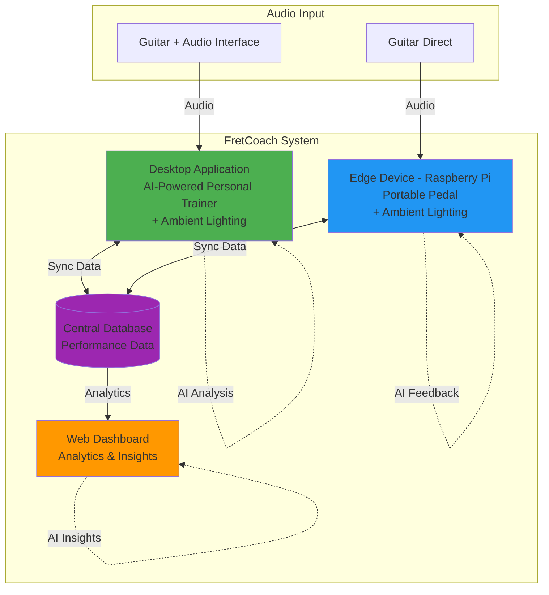

# FretCoach - An Adaptive Guitar Learning Agent

> *"FretCoach is like an AI guitar pedal that trains your brain, not your tone."*

## Overview

FretCoach is an edge-first AI learning agent designed to function like an intelligent guitar pedal for beginners, helping players fine-tune their playing through real-time evaluation and adaptive visual feedback. Instead of effects like distortion or delay, FretCoach provides **learning effects**.

## How It Works

FretCoach listens to live guitar input and evaluates:
- **Pitch accuracy**
- **Scale conformity**
- **Timing stability**
- **Note transitions**

It translates performance quality into immediate visual lighting cues. These cues act as a subconscious training signal, allowing the brain to adapt and self-correct while playing — much like how traditional pedals shape tone.

## Intelligent Coaching

Beyond real-time feedback, FretCoach operates as an autonomous coach. The system:
- Aggregates performance metrics over time
- Identifies dominant learning bottlenecks
- Uses a large language model in a slow, reflective loop to synthesize structured metrics
- Diagnoses learning issues and adapts future training strategies

All real-time audio analysis and feedback remain **deterministic** and run locally on a Raspberry Pi.

## Key Features

- **Real-time visual feedback** - Instant lighting cues guide your playing
- **Edge-first architecture** - Runs entirely on Raspberry Pi
- **Adaptive learning** - AI analyzes patterns and adjusts training
- **Embodied feedback** - Physical, tangible learning experience
- **Extensible design** - Architecture can generalize to other instruments and vocal training

## System Architecture

FretCoach consists of three interconnected components, all powered by AI and connected to a central database:

### 1. Desktop Application (Main Focus)
Your **personal guitar trainer** running on your computer:
- Advanced visualization and real-time feedback
- **Ambient lighting control** synchronized with performance
- Professional audio interface support (e.g., Focusrite Scarlett)
- AI-powered coaching and adaptive learning algorithms
- Database integration for progress tracking
- Rich UI for detailed metrics and analysis

This is the primary training environment, offering the most comprehensive learning experience.

### 2. Portable Edge Device (Raspberry Pi Pedal)
A standalone physical device designed as an intelligent guitar pedal:
- Raspberry Pi controller with integrated ADC
- Real-time audio processing and analysis
- **Ambient lighting control** for visual feedback
- Powered by AI for intelligent feedback
- Database connectivity for performance tracking
- Portable and stage-ready

Perfect for practice sessions, live performances, and on-the-go training.

### 3. Web Dashboard
Cloud-based performance analytics and insights:
- Historical performance tracking and trends
- Progress visualization across sessions
- Cross-device synchronization (pedal and desktop)
- AI-generated insights and recommendations
- Goal setting and achievement tracking
- Shareable progress reports

All three components leverage AI integration and communicate with a central database, creating a unified learning ecosystem that adapts to your progress whether you're practicing at home or on the go.

## Philosophy

FretCoach transforms unstructured practice into a guided learning loop, acting as a physical, intelligent pedal that trains the player — not the sound. While demonstrated for guitar practice, the architecture is designed to generalize to other instruments and vocal training that benefit from adaptive, embodied feedback.
