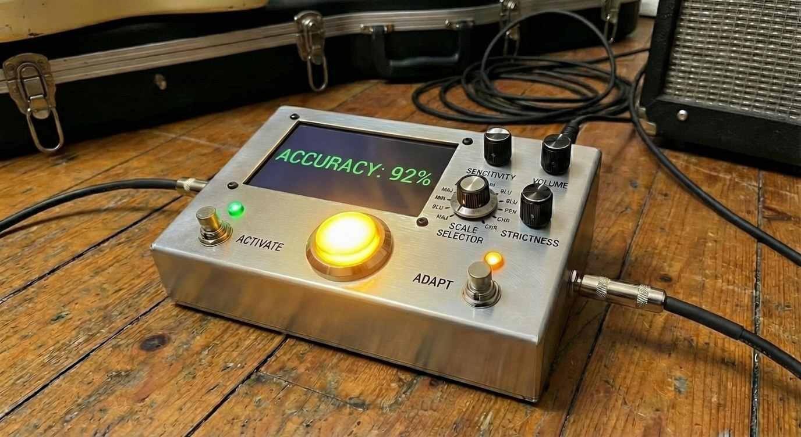
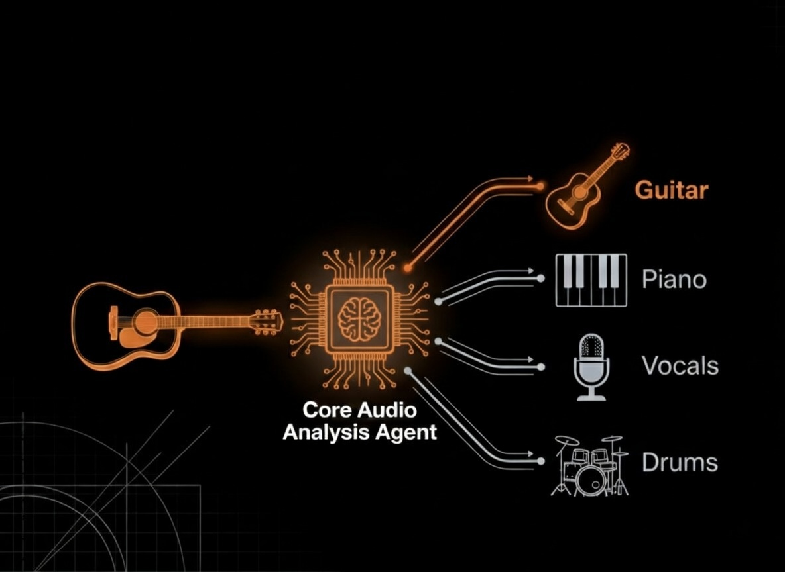

# FretCoach : AI-Powered Adaptive Guitar Training

> **It’s time to turn your 2026 guitar resolutions into reality.**



**A real-time AI music practice system for guitar that listens, reacts, and coaches while you play.**

> **Already know about FretCoach and want to run the code right away?** Jump to the [Quickstart Guide](docs/quickstart.md) to get started. **New here?** Read on to understand what makes this different.

## Contents

- [Overview](#overview)
- [The FretCoach Approach](#the-fretcoach-approach)
- [Platform Ecosystem](#platform-ecosystem)
- [For Commit To Change Hackathon Judges](#for-commit-to-change-hackathon-judges-)
- [What FretCoach Is and How It Operates](#what-fretcoach-is-and-how-it-operates)
- [Future Expandability](#future-expandability)
- [System Architecture](#fretcoach---system-architecture)
  - [1. FretCoach Studio](#1-fretcoach-studio-desktop-application)
  - [2. FretCoach Portable](#2-fretcoach-portable-raspberry-pi-device)
  - [3. FretCoach Hub](#3-fretcoach-hub-web-platform)
  - [4. Ambient Lighting](#4-ambient-lighting)
- [Technology Stack](#technology-stack)
- [Feature Matrix](#feature-matrix)
- [Documentation](#documentation)
- [Repository Structure](#repository-structure)

---

## Overview

**FretCoach is a real-time AI guitar practice system** that listens as you play and delivers **instant feedback**, fixing mistakes **in the moment** — not after the session is over.

Traditional practice relies on delayed feedback — from teachers, recordings, or self-review — by which time mistakes have already turned into muscle memory. FretCoach closes this gap by delivering immediate, multi-sensory feedback that enables correction before errors are reinforced through repetition.

**Most tools explain errors after the fact. FretCoach intervenes before repetition turns them into defaults.**

---

## The FretCoach Approach


**Close the feedback loop from days to milliseconds:**

- **Local Audio Analysis Agent Engine:** A real-time audio analysis engine that listens to every note and computes live performance metrics
- **AI Practice Coach:** Provides conversational coaching grounded in measured performance data during the session. Outside the session, aggregates metrics over time to identify trends and generate targeted practice recommendations based on weak areas.
- **Multi-sensory feedback:** Visual live on-screen metrics, spoken feedback, and ambient environmental feedback (*Yes! Your environment becomes a feedback channel*) through smart light changes.
- **Gamification:** Scores, color signals, and progress tracking to reinforce consistency and motivation

Every note you play is evaluated immediately, with deviations detected in real time.

**Result:** Neuroadaptive learning that shapes motor behavior in real time—not retroactively.

> 🧠 **Neuroscience insight:** It's significantly harder to unlearn a motor habit than to prevent one ([Dayan & Cohen](https://pmc.ncbi.nlm.nih.gov/articles/PMC3217208/)). Early-stage neuroplasticity is fast and fragile—and FretCoach operates inside this critical window.

---

## Platform Ecosystem

FretCoach is built as a three-part system, with all components connected through a shared central database.


- **FretCoach Studio** — Desktop application for real-time practice, live AI coaching, and ambient lighting feedback
- **FretCoach Portable** — Raspberry Pi–powered portable unit for practicing on-the-go
- **FretCoach Hub** — Web-based dashboard for analytics, progress tracking, session review, and AI-driven practice planning

> **Like having a coach next to you, wherever you go!!**

---

## For Commit To Change Hackathon Judges 🏆

**Want to understand FretCoach super fast?** Check out the <a href="https://docs.google.com/presentation/d/1Mm2ERUg9ZhWOH_aVsTBwBKI8s9U_AHglDOdXagMTqBY/edit?usp=sharing" target="_blank">quick deck</a> and <a href="https://youtu.be/ko7pAXDDkJQ" target="_blank">explainer video</a> for a rapid overview. I’d strongly recommend reading this README end-to-end to understand the full system design.

**For judges of the "Best Use of Opik" category:** Please see [opik/opik-usage.md](opik/opik-usage.md) or [opik/opik-usage.pdf](opik/opik-usage.pdf) for detailed documentation on all the Opik features I've explored and implemented.

**Personal note on Opik:** Wow, what a tool! Why have I not been using Opik for my LLM projects before? I'm genuinely impressed—from advanced tracing capabilities, agent graphs for LangGraph visualization, custom eval metrics, and dashboards, to AI Assist. Right after this hackathon, I'm certain I'll be integrating Opik into my work projects. This isn't just hackathon enthusiasm—I've found a tool that solves real problems I face daily with LLM observability and optimization.

---

## What FretCoach Is and How It Operates

### Preventive Neurofeedback Music Learning System

FretCoach is a **Preventive Neurofeedback System** — it shapes motor behavior in real time before maladaptive patterns form. Instead of corrective feedback after mistakes solidify, FretCoach intervenes **during skill execution**, inside the brain's plasticity window.

> **Prevention is neuroadaptive. Correction is retrofitting.**

This system follows a **dual-brain architecture**, which we call **Real-time Augmented Feedback (RAF)**—analogous to how RAG augments generation with retrieval, RAF augments real-time execution by pairing fast deterministic processing with intelligent AI coaching.


---

### The Two Systems

**Audio Analysis Agent (Fast Loop) - Left Brain**
- Real-time processing (<300ms latency)
- On-device local processing, no cloud dependency
- Continuous pitch, scale, timing, noise evaluation using *Digital Signal Processing*
- Controls on screen performance metrics and ambient lighting system

**LLM Powered AI Coach (Slow Loop) - Right Brain**
- LLM-powered preventive coaching: Provides consistent vocal and textual feedback at regular intervals during live playing for instant improvement
- Post-session pattern analysis and personalized practice plan curation based on identified weak areas
- On-demand (not real-time critical)
- Powered by LLM models: Gemini 3 Flash Preview, OpenAI GPT-4o-mini, GPT-4o-mini-TTS

> **Hybrid architecture: local speed + AI intelligence = intervention before habits solidify.**

---

### Performance Metrics

FretCoach currently targets scales in music (think of them as the vegetables of the music world—you gotta eat them!).

The audio analysis engine evaluates your playing across four core metrics:

| Metric | What It Measures |
|--------|------------------|
| **Pitch Accuracy** | Note accuracy and intonation against the target scale |
| **Scale Conformity** | Scale coverage and adherence |
| **Timing Stability** | Rhythmic and timing consistency |
| **Noise Control** | String noise and unwanted artifacts |

Three feedback channels:
- **On-screen metrics** — Live scores and note detection
- **AI Voice Coach** — Textual and spoken guidance via GPT-4o-mini and GPT-4o-mini-TTS models
- **Ambient lighting** — Smart bulb feedback (green = good, red = needs work)

---

## Future Expandability

**Starts With Guitar, Expands Everywhere**

One coaching core. Many instruments.
AI-powered instant feedback for any skill-based training—music, sports, and beyond.

<p align="center">
  
</p>

FretCoach's core audio analysis engine is designed to be instrument-agnostic. The same real-time feedback architecture that evaluates guitar playing can be adapted for piano, vocals, drums, and other instruments. Guitar is just the starting point.

The long-term vision is an AI-powered instant feedback system that coaches in real time — across music, sports, and skill training — using sound, vision, and sensors. Imagine an AI system that detects when a beginner's deadlift form breaks and responds with multi-sensory feedback — a haptic pulse alerts them, followed instantly by a corrective voice cue: "Don't round your back." That kind of system could prevent injury, not just analyze mistakes after the fact.

This broader vision is what **Real-time Augmented Feedback (RAF)** enables — AI-augmented real-time coaching, across any domain.

> **If feedback arrived the moment you made a mistake, how would that change the way you practice?**
> **And what skill would you want AI to coach you on?**

---

## FretCoach - System Architecture

### High-Level Architecture

```
                    ┌─────────────────────────────────────────────┐
                    │   CENTRAL DATABASE (PostgreSQL/Supabase)    │
                    │                                             │
                    │  • Practice Sessions & Metrics              │
                    │  • AI-Generated Practice Plans              │
                    │  • User Configs & Preferences               │
                    │  • Cross-Device Synchronization             │
                    └──────┬──────────────┬──────────────┬────────┘
                           │              │              │
         ┌─────────────────┴──────┐       │       ┌──────┴─────────────────┐
         │                        │       │       │                        │
         ▼                        ▼       ▼       ▼                        ▼
┌─────────────────────┐  ┌─────────────────────────────┐  ┌─────────────────────┐
│  FRETCOACH STUDIO   │  │     FRETCOACH HUB (Web)     │  │ FRETCOACH PORTABLE  │
│    (Desktop App)    │  │                             │  │   (Raspberry Pi)    │
├─────────────────────┤  ├─────────────────────────────┤  ├─────────────────────┤
│                     │  │                             │  │                     │
│ Stack:              │  │ Frontend:                   │  │ Hardware:           │
│ • Electron          │  │ • React    + TypeScript     │  │ • Raspberry Pi 5    │
│ • React             │  │ • Vite + Tailwind CSS       │  │ • Scarlett Solo USB │
│ • Python FastAPI    │  │ • shadcn/ui + Recharts      │  │                     │
│ • librosa + NumPy   │  │                             │  │ Stack:              │
│                     │  │ Backend:                    │  │ • Python FastAPI    │
│ Features:           │  │ • Python FastAPI            │  │ • librosa + NumPy   │
│ • Live Audio        │  │ • LangGraph + LangChain     │  │ • Same Engine       │
│   Analysis          │  │ Features:                   │  │                     │
│ • Real-time         │  │ • AI Chat Coach             │  │ • Portable Practice │
│   Metrics           │  │ • Session Analytics         │  │ • Edge Processing   │
│ • AI Voice Coach    │  │ • Performance Trends        │  │ • Offline Capable   │
│ • Practice Plans    │  │ • Practice Plan Generator   │  │ • Smart Lighting    │
│ • Smart Lighting    │  │                             │  │ • Database Sync     │
│                     │  │                             │  │                     │
└──────────┬──────────┘  └─────────────────────────────┘  └──────────┬──────────┘
           │                                                         │
           ▼                                                         ▼
   ┌───────────────┐                                          ┌──────────────┐
   │ Scarlett Solo │                                          │ Integrated   │
   │  USB Audio    │                                          │ Audio Input  │
   └───────┬───────┘                                          └──────┬───────┘
           │                                                         │
           ▼                                                         ▼
         🎸 Guitar                                                 🎸 Guitar


                        ┌───────────────────────────────┐
                        │   AMBIENT FEEDBACK (Optional) │
                        │                               │
                        │  💡 Smart Bulb (Tuya WiFi)    │
                        │                               │
                        │  🟢 Green  → Excellent (70%+) │
                        │  🟡 Yellow → Good (50-70%)    │
                        │  🟠 Orange → Average (30-50%) │
                        │  🔴 Red    → Needs Work (<30%)│
                        └───────────────────────────────┘
```
---

> **Setup:** Install [uv](https://docs.astral.sh/uv/) and run `uv sync` for Python dependencies. Install [Node.js 18+](https://nodejs.org/) and run `npm install` for JavaScript components.

### 1. FretCoach Studio (Desktop Application)

**Location:** `/application/`

Desktop application for focused practice sessions.

<p align="center">
  
  
</p>

#### Features
- Real-time audio analysis (USB interface or built-in mic)
- Live visual metrics and performance scoring
- Manual (choose scale/settings) and AI practice modes (recommended plans)
- Live vocal AI coaching during sessions. (*Imagine a courtside basketball coach*)
- Ambient lighting feedback
- Automatic session logging and summaries

#### Getting Started
**Prerequisites:**
- Node.js 18+
- Python 3.12+
- Audio interface (Focusrite Scarlett Solo recommended) or built-in mic

**Installation:**
```bash
cd application
npm install
npm run dev  # Starts Electron + React frontend + Python FastAPI backend
```
> **Environment setup:** See [docs/environment-setup.md](docs/environment-setup.md)

---

### 2. FretCoach Portable (Raspberry Pi Device)

> **Like a portable guitar pedal**
>
> Software functional; hardware enclosure in design phase — evolving into a physical unit with custom enclosure, LCD display, and footswitch for On/Off control.


**Location:** `/portable/`

<p align="center">
  
</p>

<p align="center">
  
</p>

Raspberry Pi 5-based portable practice device. Same analysis engine as Studio, but on-the-go.

**Status:** Software fully functional; physical enclosure and touchscreen interface in design phase

### Features
- Same core engine as the FretCoach Studio
- Real-time edge device processing
- Ambient lighting feedback
- Manual and AI practice modes
- Database sync

**Hardware:**
- Raspberry Pi 5 (8GB RAM)
- Focusrite Scarlett Solo USB
- microSD 64GB+

**Getting Started:**
```bash
cd portable
./start.sh
```

**Current Progress:**
- ✅ Hardware setup complete
- ✅ Audio I/O testing successful
- ✅ Software integration in progress
- ✅ Database sync mechanism implemented
- 📋 **Planned:** Physical enclosure design, footswitch control, LCD touchscreen interface

---

### 3. FretCoach Hub (Web Platform)

**Website:** [fretcoach.online](https://www.fretcoach.online)<br>
**Analytics and AI Coach Dashboard:** [fretcoach.online/dashboard](https://www.fretcoach.online/dashboard)

Web platform for analytics and practice planning.

<p align="center">
  
  
  
</p>

#### Features
- AI chat coach (text-to-SQL agent + Gemini 3 Flash Preview)
- Performance analytics and trend charts
- AI-generated practice plans
- Session history and statistics

> **Demo Note:** The live deployment at [fretcoach.online](https://www.fretcoach.online) shows two sample users for demonstration purposes.

#### Getting Started

**Local Development:**

Start both backend and frontend together using the start script:
```bash
cd web
./start.sh
```

Or manually start them separately:

**Backend:**
```bash
cd web/web-backend
uvicorn main:app --host 0.0.0.0 --port 8000 --reload
```

**Frontend:**
```bash
cd web/web-frontend
npm install
npm run dev  # http://localhost:5173
```

> **Environment setup:** See [docs/environment-setup.md](docs/environment-setup.md)

---

### 4. Ambient Lighting

Smart bulb integration for visual performance feedback.

#### Color Coding
- 🟢 Green — Good playing (70%+)
- 🟡 Yellow-Green — Could be better (50-70%)
- 🟠 Yellow — Average (30-50%)
- 🔴 Red — Below average (<30%)

> **Configuration:** See [docs/environment-setup.md](docs/environment-setup.md#smart-bulb-setup-tuya)

---

## Technology Stack

| Area | Technology |
|------|------------|
| **Desktop** | Electron 28, React 18, Vite, Tailwind CSS |
| **Web Frontend** | React 18, TypeScript, shadcn/ui, Recharts, TanStack Query |
| **Backend** | Python 3.12+, FastAPI, LangChain, LangGraph |
| **Audio** | librosa, NumPy, SciPy, sounddevice |
| **Database** | PostgreSQL (Supabase) |
| **LLM** | OpenAI GPT-4o-mini + TTS, Google Gemini 3 Flash Preview |
| **Observability** | Comet Opik |
| **Deployment** | Vercel (frontend), Railway (backend) |
| **Smart Bulb** | Tuya Cloud API (tinytuya) |

---
## Feature Matrix

| Feature | Studio | Hub | Portable |
|---------|:------:|:---:|:--------:|
| Real-time Audio Analysis | ✅ | — | ✅ |
| 4 Metric Evaluation | ✅ | — | ✅ |
| Live Visual Feedback | ✅ | — | ✅|
| Smart Bulb Integration | ✅ | — | ✅ |
| AI Voice Coaching | ✅ | — | 📋 |
| AI Practice Plans | ✅ | ✅ | ✅ |
| Session Logging | ✅ | View | ✅ |
| Performance Analytics | 📋 | ✅ | — |
| AI Chat Coach | 📋 | ✅ | — |
| Trend Visualization | 📋 | ✅ | — |
| Cloud Sync | ✅ | ✅ | ✅ |
| Offline Capable | ✅ (Manual Mode)| — | ✅ (Manual Mode)|

**Legend:** ✅ Complete | 🚧 In Progress | 📋 Planned

---

## Documentation

📚 **For comprehensive documentation, visit: [FretCoach Docs](https://padmanabhan-r.github.io/FretCoach/)**

> **Note:** Documentation is under active refinement for clarity and completeness. The current version represents an initial draft.

### Quick Links

- [Architecture Overview](https://padmanabhan-r.github.io/FretCoach/architecture.html) — Comprehensive technical documentation
- [Environment Setup](https://padmanabhan-r.github.io/FretCoach/environment-setup.html) — Configuration guide for all platforms
- [Desktop Application](https://padmanabhan-r.github.io/FretCoach/desktop-app.html) — Studio setup and usage
- [Audio Analysis Agent Engine](https://padmanabhan-r.github.io/FretCoach/audio-analysis-agent-engine.html) — Real-time audio processing (Fast Loop)
- [AI Coach Agent Engine](https://padmanabhan-r.github.io/FretCoach/ai-coach-agent-engine.html) — LLM-powered coaching (Slow Loop)
- [Portable Application](https://padmanabhan-r.github.io/FretCoach/portable-app.html) — Raspberry Pi device documentation
- [Web Dashboard](https://padmanabhan-r.github.io/FretCoach/web-dashboard.html) — Analytics and AI coach platform
- [Opik Integration](opik/opik-usage.md) — Observability and monitoring ([PDF version](opik/opik-usage.pdf))

---

## Repository Structure

> **Note:** This is a monorepo containing the core FretCoach systems (Studio, Portable, and Hub applications). The web platform code exists both in this repository (`/web/web-backend/`, `/web/web-frontend/`) and as separate deployment repositories for automated CI/CD to Railway and Vercel:
>
> - **Web Backend:** [github.com/padmanabhan-r/FretCoach-Web-Backend](https://github.com/padmanabhan-r/FretCoach-Web-Backend) (mirrors `/web/web-backend/`)
> - **Web Frontend:** [github.com/padmanabhan-r/FretCoach-Web-Frontend](https://github.com/padmanabhan-r/FretCoach-Web-Frontend) (mirrors `/web/web-frontend/`)
>

---

> **⚠️ Important for Testing:** The smart bulb integration (ambient lighting) is completely optional. FretCoach works perfectly without it—just leave the `HAVELLS_*` environment variables blank in your `.env` file. The system will automatically disable lighting features and continue normally. All core functionality (audio analysis, AI coaching, metrics) works independently.

---

## Contributing

FretCoach is under active development. Contributions, ideas, suggestions, bug reports, and feature requests are welcome.

Extra hands are always welcome to help build the product and scale it across multiple instruments.

---

**FretCoach** — *Built with love for the music and the guitar* 🎸

---

**Author:** [Padmanabhan Rajendrakumar](https://www.linkedin.com/in/padmanabhan-rajendrakumar/)


