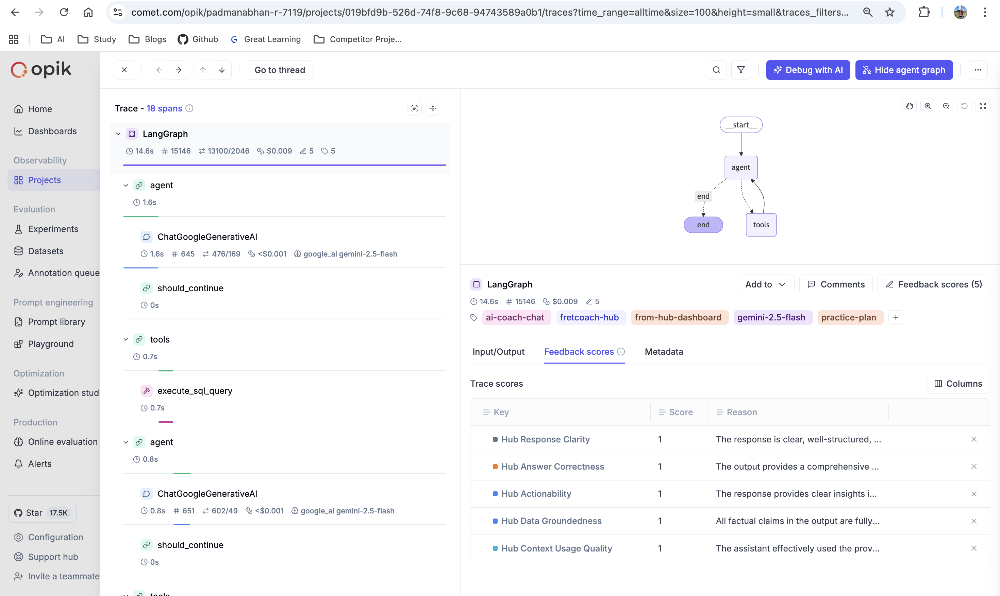
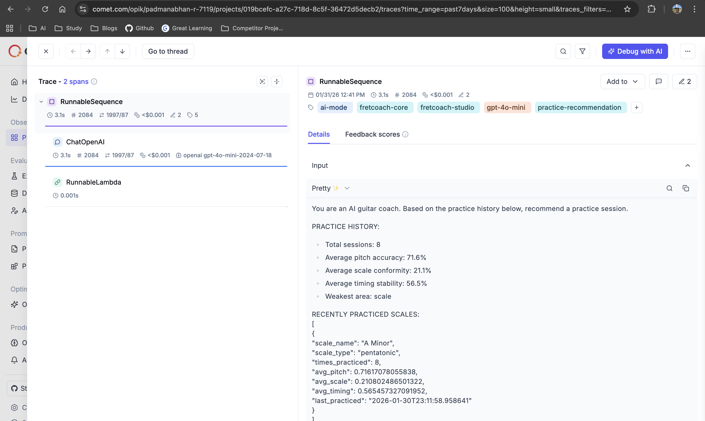
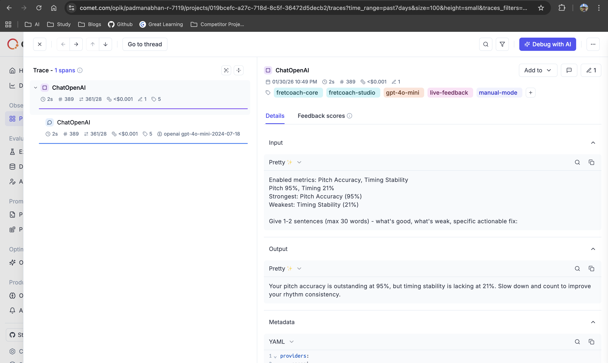
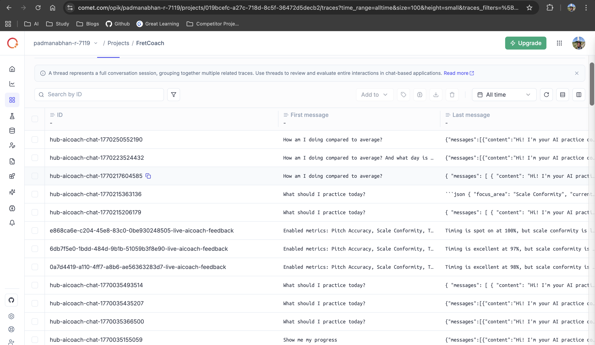

# Opik Integration in FretCoach

## Features Implemented

### 1. Traces with Metadata and Tags

All LLM calls are logged as traces in Opik with proper tags to organize and filter different types of interactions.

**Hub Coach Chats:**
- Tags: `ai-coach-chat`,`fretcoach-hub`, `from-hub-dashboard`, `gemini-2.5-flash`, `practice-plan`
- Used for AI coach conversations in the web dashboard

  

**AI Mode (Practice Recommendations):**
- Tags: `fretcoach-core`, `gpt-4o-mini`, `ai-mode`, `fretcoach-studio`, `practice-recommendation`
- Used for generating personalized practice recommendations

  

**Live AI Feedback in Session:**
- Tags: `fretcoach-core`, `gpt-4o-mini`, `ai-mode`, `fretcoach-studio`, `live-feedback`
- Used for real-time coaching feedback during practice sessions

  

---

### 2. Thread Management

Each trace uses a structured `thread_id` to group related LLM calls and maintain conversation context across multiple requests.

**Thread Naming Conventions:**

**Hub Coach Chats:**
- Format: `hub-{user_id}`
- Example: `hub-default_user`
- Groups all coach chat messages for a user's conversation session

**AI Mode (Practice Recommendations):**
- Format: `{deployment}-ai-mode-{practice_id}`
- Example: `studio-ai-mode-a1b2c3d4-e5f6-7890-abcd-ef1234567890`
- Maintains thread across multiple recommendation requests until session starts
- Uses practice_id to persist thread even when user requests new recommendations

**Live AI Feedback:**
- Format: `{session_id}-live-aicoach-feedback`
- Example: `abc123-live-aicoach-feedback`
- Groups all live feedback calls within a single practice session

  

