# Opik Integration in FretCoach

**Workspace:** `padmanabhan-r-7119`
**Projects:** `FretCoach` | `FretCoach-Hub`

---

## Features Implemented

### 1. Traces with Metadata and Tags

All LLM calls are logged as traces in Opik with structured tags for filtering and organization.

**Hub Coach Chats:**
- Tags: `ai-coach-chat`, `fretcoach-hub`, `from-hub-dashboard`, `gemini-2.5-flash`, `practice-plan`
- Tracks AI coach conversations in the web dashboard

  
   
  <em>Hub coach chat traces with proper tags in Opik dashboard</em>

**AI Mode (Practice Recommendations):**
- Tags: `fretcoach-core`, `gpt-4o-mini`, `ai-mode`, `fretcoach-studio`, `practice-recommendation`
- Tracks personalized practice recommendations

  
   
  <em>AI mode practice recommendation traces</em>

**Live AI Feedback in Session:**
- Tags: `fretcoach-core`, `gpt-4o-mini`, `ai-mode`, `fretcoach-studio`, `live-feedback`
- Tracks real-time coaching feedback during practice

  
   
  <em>Live AI feedback traces during practice sessions</em>

---

### 2. Thread Management

Structured `thread_id` to group related LLM calls and maintain conversation context.

**Thread Naming Conventions:**
- **Hub Coach:** `hub-{user_id}` - Groups all coach chat messages for a user
- **AI Mode:** `{deployment}-ai-mode-{practice_id}` - Maintains thread across recommendations
- **Live Feedback:** `{session_id}-live-aicoach-feedback` - Groups feedback within a practice session

  
   
  <em>Thread IDs grouping related traces in Opik</em>

---

### 3. Agent Graph Visualization

LangGraph execution flows visualized in Opik using `workflow.get_graph(xray=True)`.

Shows complete agent reasoning path: agent → tool calls (`execute_sql_query`, `get_database_schema`) → decision nodes → response.

  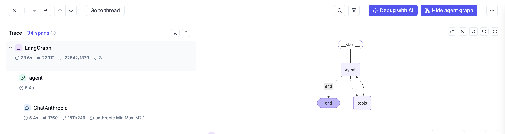
   
  <em>LangGraph agent execution flow in Opik</em>

---

### 4. Annotation Queues

Used annotation queues for human-in-the-loop evaluation of agent outputs.

**Implementation:**
- Custom feedback definitions for LLM output quality
- Manual review and rating using custom criteria
- Structured feedback collection for agent improvements

  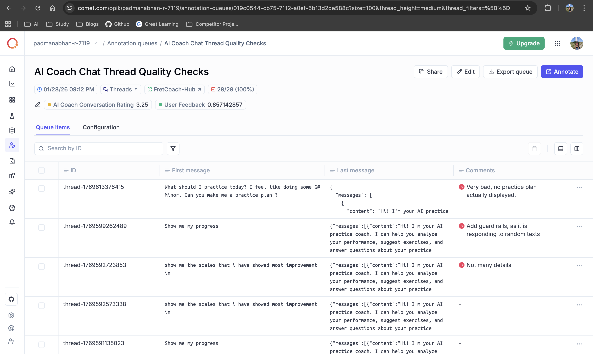
   
  <em>Annotation queue with reviewed LLM outputs</em>

---

### 5. Datasets and Prompts

Created datasets and prompts for reproducible experiments and evaluations.

**Datasets:**
- Curated test cases from real user sessions
- Used across experiment runs for consistent testing

**Prompts:**
- Version-controlled coaching prompt templates
- Used in playground for rapid iteration

  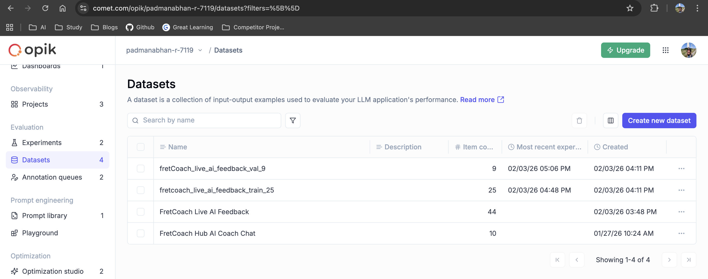
   
  <em>Datasets created for experiment runs</em>

  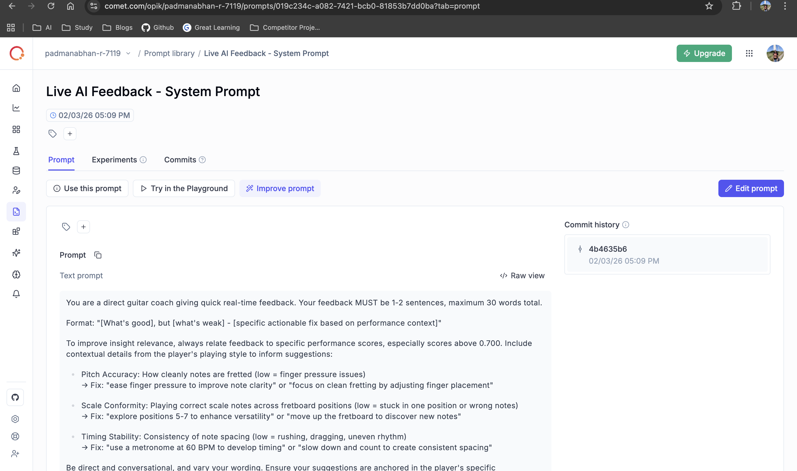
   
  <em>Saved prompts</em>

---

### 6. Experiments and Custom Metrics

Evaluated LLM performance using both default Opik metrics and custom-created metrics.

**Default Metrics:**
- Opik's built-in evaluation metrics for response quality

**Custom Metrics:**
- Domain-specific metrics tailored to guitar coaching context
- Measures coaching quality and relevance

  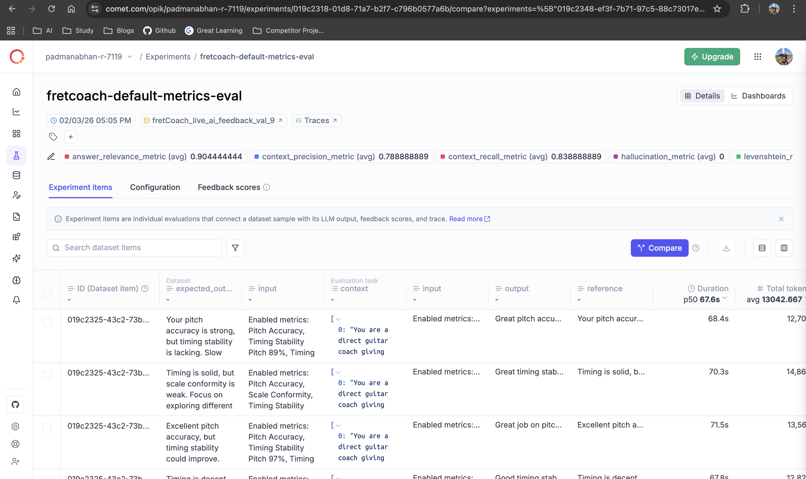
   
  <em>Experiments with default Opik metrics</em>

  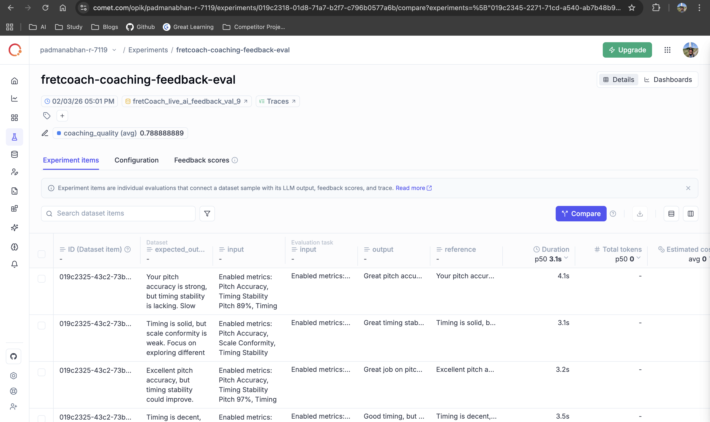
   
  <em>Experiments with custom metric</em>

---

### 7. Optimization Studio

Used Optimization Studio with HRPO (Hierarchical Reflective Prompt Optimizer) to improve the prompt used in the live feedback module.

**Results:**
- **32% increase** in `llm_judge_metric` custom metric
- Improved coaching feedback quality
- Optimized for better real-time guidance

  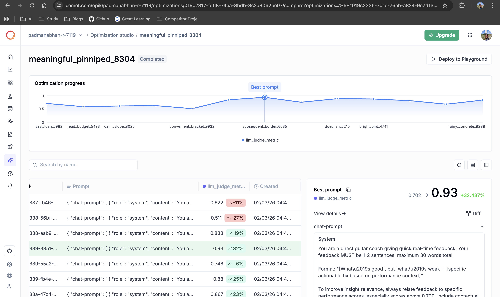
   
  <em>Optimization Studio results for live feedback prompt</em>

---

### 8. OpikAssist for Token Usage Optimization

Used OpikAssist to analyze traces and optimize token usage for hub coach chats.

**Problem Identified:**
- Excessive token usage (4,877 tokens) and long duration (7,873 ms)
- Lengthy prompts with redundant context and full SQL data

**Actions Taken:**
- Refined system and user prompts based on OpikAssist suggestions
- Streamlined SQL result formatting to essential data only
- Removed redundant context and consolidated guidelines

**Results:**
- Significant token usage reduction
- Improved response latency
- Better cost-performance ratio

  
   
  <em>OpikAssist analyzing trace for token usage optimization</em>

---

### 9. Project-Specific Configurations

Configured custom feedback definitions and AI providers for comprehensive evaluation.

**Feedback Definitions:**
- Custom fields for manual LLM output rating
- Human-in-the-loop feedback on traces
- Categorical ratings: "AI Coach Conversation Rating" and "User Feedback"

**AI Providers:**
- Perplexity's Sonar Pro for automated evaluations
- OpenRouter models for diverse evaluation perspectives
- Enhanced evaluation capabilities beyond default Opik models

  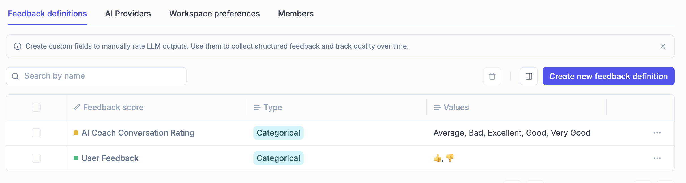
   
  <em>Custom feedback definitions for manual trace ratings</em>

  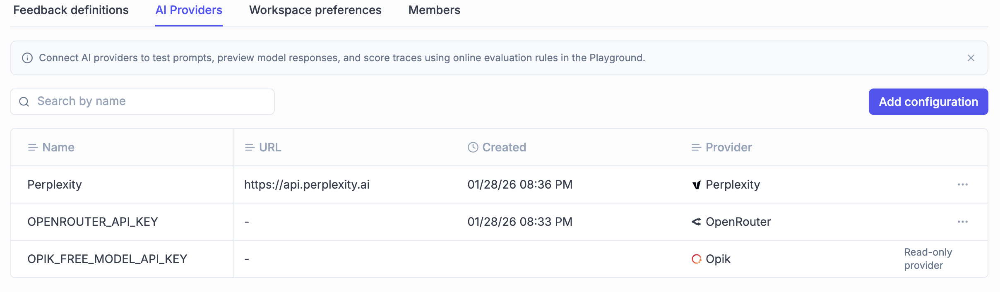
   
  <em>Custom AI providers configured for automated evaluations</em>

---

### 10. Online Evaluation

Configured **11 online evaluation rules** to automatically score production traces using LLM-as-a-Judge metrics.

**Purpose:**
- Real-time quality monitoring of AI responses in production
- Automatic evaluation without manual review
- Early detection of performance degradation or quality issues

**Rules Overview:**

**Hub Coach (7 rules):**

1. `hub_answer_correctness` - Validates factual accuracy
2. `hub_data_groundedness` - Ensures grounding in database context
3. `hub_context_usage_quality` - Checks effective use of retrieved data
4. `hub_actionability` - Measures actionable guidance
5. `hub_response_clarity` - Evaluates readability
6. `hub_conversational_coherence` - Tracks conversation flow (thread-level)
7. `hub_user_frustration_score` - Detects user frustration (thread-level)

**Studio AI Mode (4 rules):**

8. `studio_practice_recommendation_alignment` - Validates goal alignment
9. `studio_immediate_actionability` - Ensures executable recommendations
10. `studio_live_coach_feedback_quality` - Measures real-time coaching quality
11. `studio_live_feedback_effectiveness` - Tracks session improvement (thread-level)

📖 **[View complete rule prompts and variable mappings →](online-eval-rules.md)**

  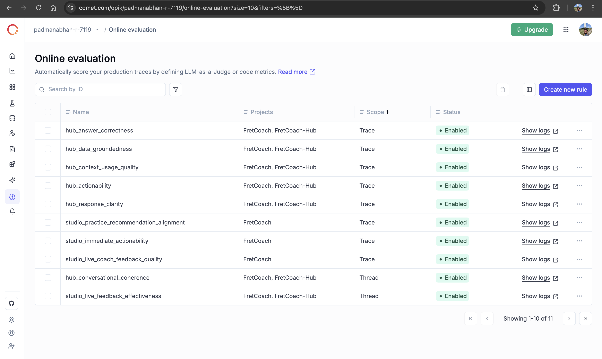
   
  <em>Online evaluation rules dashboard (1-10 of 11)</em>

  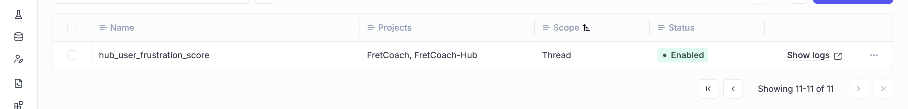
   
  <em>Online evaluation rules dashboard (11 of 11)</em>

---

### 11. Production Dashboard

A real-time dashboard monitoring key AI quality metrics across FretCoach's Studio and Hub applications.

**📊 [View Live Dashboard](https://www.comet.com/opik/padmanabhan-r-7119/dashboards/019c0358-6adc-71f9-a73b-b18f0b20679d)**

**Dashboard Structure:**

The dashboard displays 7 core metrics organized by application:

**🎸 FretCoach - Studio and Portable (Core Functionality)**

*Evaluates practice recommendations and real-time coaching effectiveness.*

| Metric | Range | What the Score Means |
|--------|-------|----------------------|
| 🎧 **Live Coach Feedback Quality** | **1 – 4** | `1` = Bad, `2` = Good, `3` = Very Good, `4` = Excellent |
| 📐 **Practice Recommendation Alignment** | **0.0 – 1.0** | `1.0` = Aligned with the player's weaknesses; `0.0` = No alignment |
| ⚡ **Practice Recommendation - Immediate Actionability** | **0.0 – 1.0** | `1.0` = Recommendation fully actionable; `0.0` = Not actionable |

**🧠 FretCoach Hub (Web)**

*Measures how well the Hub understands, answers, and guides users.*

| Metric | Range | What the Score Means |
|--------|-------|----------------------|
| ✨ **Response Clarity** | **0.0 – 1.0** | `1.0` = Clear and structured response; `0.0` = Poor response |
| 🔗 **Context Usage Quality** | **0.0 – 1.0** | `1.0` = Context effectively used; `0.0` = Poor usage of context |
| 🎯 **Actionability** | **0.0 – 1.0** | `1.0` = Clear, executable next steps; `0.0` = Vague or non-actionable |
| 🧾 **Data Groundedness** | **0.0 – 1.0** | `1.0` = Supported by user's practice data; `0.0` = Weak grounding |

**Features:**
- Real-time metric averages calculated from production traces
- Automatic updates as new LLM calls are evaluated
- Clear visibility into AI quality across different use cases
- Easy identification of performance degradation

  
   
  <em>Live production dashboard with real-time AI quality metrics</em>

---

### 12. Alerts & Notifications

Configured Slack alerts to proactively monitor AI quality and system health in production.

**Setup:**
- Created a dedicated Slack channel: `#opik-alerts`
- Integrated Opik with Slack using webhook configuration
- Configured alerts for critical metrics and system errors

**Alert Types:**

**1. Trace Errors Threshold**
- **Trigger:** When trace error count exceeds 10 in the last 30 minutes
- **Purpose:** Detect system failures or integration issues

**2. Feedback Score Thresholds**
- **Trigger:** When average metric scores fall below 0.6 in the last 30 minutes
- **Monitored Metrics:**
  - Hub Response Clarity < 0.6
  - Hub Data Groundedness < 0.6
  - Hub Context Usage Quality < 0.6
  - Hub Answer Correctness < 0.6
  - Hub Actionability < 0.6
- **Purpose:** Early detection of AI quality degradation

**3. Latency Alerts**
- **Trigger:** When average latency exceeds 3 seconds in the last 30 minutes
- **Purpose:** Monitor response time performance and identify slowdowns

**Benefits:**
- Proactive issue detection before users report problems
- Real-time visibility into production AI quality
- Team-wide awareness through Slack notifications
- Quick response to quality degradation or system errors

  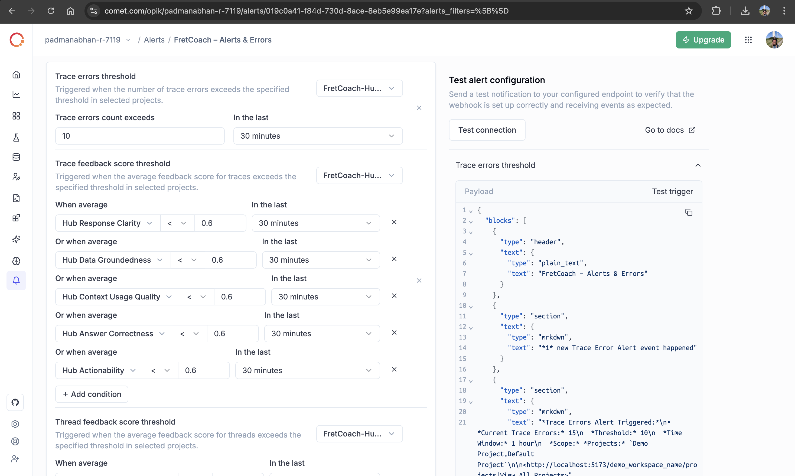
   
  <em>Alert configuration in Opik dashboard</em>

  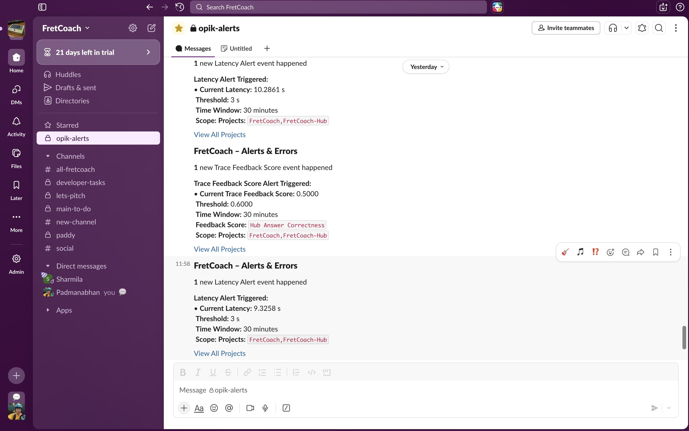
   
  <em>Real-time alerts delivered to Slack #opik-alerts channel</em>

